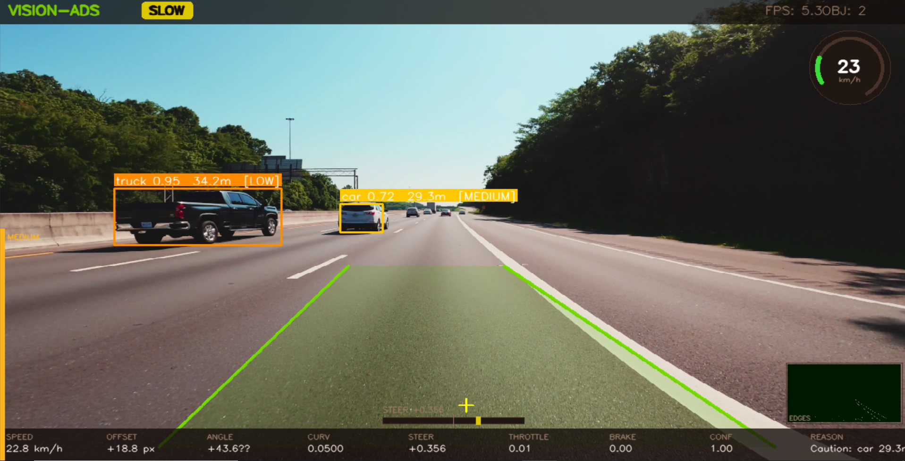
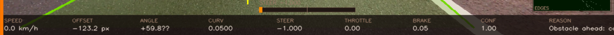
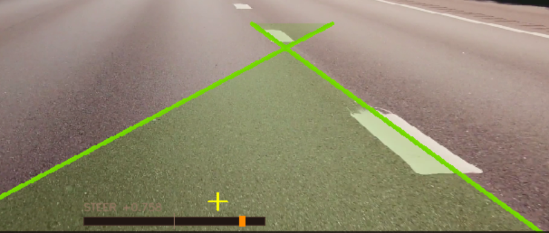
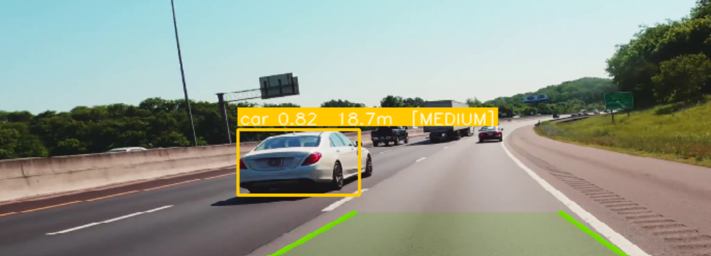

<div align="center">



# Vision-Only Autonomous Driving System

### *A production-grade, modular ADS stack powered by a single RGB camera*

[](https://www.python.org/)
[](https://opencv.org/)
[](https://github.com/AlexeyAB/darknet)
[](LICENSE)
[](https://github.com)

<br/>

> **No LiDAR. No GPS. No simulator ground-truth. Just one RGB camera.**  
> Vision ADS processes any dashcam or simulation video and outputs a  
> fully-annotated, real-time autonomous driving stream with lane tracking,  
> object detection, distance estimation, threat analysis, and a  
> Tesla-style cockpit HUD — all running on CPU.

<br/>

<!-- Replace the src paths below with real screenshots once you have them -->
| HUD Dashboard | Lane Detection | Object Detection |
|:---:|:---:|:---:|
|  |  |  |
| Tesla-style cockpit overlay | CLAHE + adaptive Canny | YOLOv4-tiny per-class NMS |

</div>

---

## Table of Contents

1. [Project Overview](#1-project-overview)
2. [System Architecture](#2-system-architecture)
3. [Technology Stack](#3-technology-stack)
4. [Module Specifications](#4-module-specifications)
   - [Perception Layer](#41-perception-layer)
   - [Decision Layer](#42-decision-layer)
   - [Control Layer](#43-control-layer)
   - [Visualisation & Recording](#44-visualisation--recording)
5. [Folder Structure](#5-folder-structure)
6. [Installation Guide](#6-installation-guide)
7. [Running the System](#7-running-the-system)
8. [Configuration & Tuning](#8-configuration--tuning)
9. [Performance Optimisation](#9-performance-optimisation)
10. [Adding Your Own Image / Screenshot](#10-adding-your-own-image--screenshot)
11. [Future Roadmap](#11-future-roadmap)
12. [License](#12-license)

---

## 1. Project Overview

Vision ADS is a **three-layer autonomous driving stack** designed to demonstrate real-world ADS principles without any privileged simulator data, depth sensors, or positioning hardware. It accepts a standard MP4 dashcam recording (or a live webcam feed) as its only input, and runs a full perception → decision → control loop in real time.

### Key Design Goals

| Goal | How it is achieved |
|---|---|
| **Single camera only** | All perception derived from RGB pixels: no LiDAR, radar, GPS, or semantic segmentation |
| **CPU-friendly** | YOLOv4-tiny + OpenCV DNN; no GPU required; runs at 12–20 FPS on a modern laptop CPU |
| **No simulator dependency** | Works on any MP4 video; CARLA / SUMO integration is optional and non-required |
| **Production architecture** | Strictly modular: Perception → Decision → Control with typed dataclass interfaces |
| **Zero class confusion** | Strict COCO class-ID → driving-name mapping; per-class NMS prevents truck/car mislabelling |
| **Temporal stability** | EMA smoothing on every output; confidence-weighted steering; Kalman-style distance EMA |

---

## 2. System Architecture

```
┌──────────────────────────────────────────────────────────────────────────────┐
│                        VISION ADS  –  Full Pipeline                          │
│                                                                              │
│   ┌───────────────┐                                                          │
│   │  Video Source  │  MP4 file / webcam / CARLA camera sensor               │
│   │  (RGB frames)  │                                                         │
│   └───────┬───────┘                                                          │
│           │  BGR uint8 frame (1280×720 default)                              │
│           ▼                                                                  │
│   ┌─────────────────────────────────────────────────────────┐               │
│   │                  PERCEPTION  LAYER                       │               │
│   │                                                         │               │
│   │  ┌──────────────────────┐   ┌───────────────────────┐  │               │
│   │  │   Lane Detector       │   │   Object Detector      │  │               │
│   │  │                      │   │                       │  │               │
│   │  │  CLAHE enhancement   │   │  YOLOv4-tiny (COCO)   │  │               │
│   │  │  Otsu-adaptive Canny │   │  Per-class NMS         │  │               │
│   │  │  Dual-pass Hough     │   │  Monocular distance    │  │               │
│   │  │  Weighted-median fit │   │  TL zone classifier    │  │               │
│   │  │  EMA smoothing       │   │  Threat analyzer       │  │               │
│   │  │                      │   │                       │  │               │
│   │  │  → LaneData          │   │  → [DetectedObject]   │  │               │
│   │  └──────────────────────┘   └───────────────────────┘  │               │
│   └────────────────────┬──────────────────┬────────────────┘               │
│                        │  LaneData        │  [DetectedObject]               │
│                        ▼                  ▼                                  │
│   ┌─────────────────────────────────────────────────────────┐               │
│   │                  DECISION  LAYER                         │               │
│   │                                                         │               │
│   │   Priority FSM:  Emergency → TL FSM → Stop-Sign FSM    │               │
│   │                   → Gap Model → Curvature → Cruise      │               │
│   │                                                         │               │
│   │   → DrivingDecision (state, target_speed, brake_force)  │               │
│   └────────────────────────────┬────────────────────────────┘               │
│                                │  DrivingDecision + LaneData                │
│                                ▼                                             │
│   ┌─────────────────────────────────────────────────────────┐               │
│   │                  CONTROL  LAYER                          │               │
│   │                                                         │               │
│   │   Steering PID  (Kp + Ki + Kd + feed-forward angle)    │               │
│   │   Speed PID     (Kp + Ki + anti-windup)                 │               │
│   │   Emergency override                                    │               │
│   │                                                         │               │
│   │   → VehicleCommand (steering, throttle, brake, speed)   │               │
│   └────────────────────────────┬────────────────────────────┘               │
│                                │                                             │
│                                ▼                                             │
│   ┌─────────────────────────────────────────────────────────┐               │
│   │            HUD Dashboard  +  VideoRecorder              │               │
│   │   Analogue gauge · State pill · TL dot · Edge inset     │               │
│   │   Urgency strip · Emergency flash · Telemetry strip     │               │
│   └─────────────────────────────────────────────────────────┘               │
└──────────────────────────────────────────────────────────────────────────────┘
```

### Data Flow Summary

```
Frame → LaneData + [DetectedObject] → DrivingDecision → VehicleCommand → Annotated Frame
```

All inter-module communication uses **typed Python dataclasses** — no global state, no implicit coupling.

---

## 3. Technology Stack

### Core Libraries

| Library | Version | Role |
|---|---|---|
| **Python** | 3.9+ | Runtime language |
| **OpenCV** (`opencv-python`) | ≥ 4.8.0 | All CV, DNN inference, video I/O |
| **NumPy** | ≥ 1.24.0 | Array maths, image processing |
| **Pillow** | ≥ 9.5.0 | Image loading utilities |
| **tqdm** | ≥ 4.65.0 | Download progress bars |

### Computer Vision Techniques

| Technique | Used In | Purpose |
|---|---|---|
| **CLAHE** (Contrast Limited Adaptive Histogram Equalisation) | Lane detection | Enhances contrast in shadows and glare before edge detection |
| **Otsu's Method** | Lane detection | Auto-selects adaptive Canny thresholds per frame |
| **Gaussian Blur** | Lane detection | Noise suppression before edge detection |
| **Canny Edge Detection** | Lane detection | Gradient-based edge map |
| **Probabilistic Hough Transform** (`HoughLinesP`) | Lane detection | Detects line segments from edge pixels |
| **Weighted Median of Slopes** | Lane detection | Outlier-robust lane-line fitting (replaces polyfit) |
| **Exponential Moving Average (EMA)** | Lane + Distance | Temporal smoothing across frames |
| **ROI Masking** (trapezoidal) | Lane detection | Restricts Hough to the drivable zone |
| **RANSAC-style weighted fitting** | Lane detection | Length-weighted slope/intercept estimation |
| **HSV Colour Space Analysis** | Traffic light | Vertical-zone (top/mid/bottom) red/yellow/green classification |
| **Background-subtraction thresholding** (Otsu) | Mock detector | Blob-based object region proposals |
| **Per-class Non-Maximum Suppression** | Object detection | Prevents car from suppressing truck at same location |

### Deep Learning Models

| Model | Format | Size | Classes | Used For |
|---|---|---|---|---|
| **YOLOv4-tiny** | Darknet `.cfg` + `.weights` | ~23 MB | 80 (COCO) | Primary real-time object detector |
| **MobileNet SSD** | Caffe `.prototxt` + `.caffemodel` | ~23 MB | 21 (VOC) | Lightweight fallback detector |
| **Mock Detector** | Pure OpenCV (no weights) | 0 MB | 5 driving classes | Development / testing fallback |

**YOLOv4-tiny** is run via **OpenCV's `cv2.dnn` module** — no PyTorch or TensorFlow required. This means the entire stack runs on CPU with no deep-learning framework installation needed beyond OpenCV.

### Algorithms & Control Theory

| Algorithm | Module | Description |
|---|---|---|
| **PID Controller** (with anti-windup) | Steering | `steering = Kp×e + Ki×∫e·dt + Kd×de/dt`; integral term prevents steady-state lane offset |
| **Feed-Forward Lane Angle** | Steering | Adds `lane_angle × 0.004` before error builds up on curves |
| **Proportional–Integral Speed Controller** | Speed | Throttle = `Kp × speed_error + Ki × ∫error`; resets integral on brake |
| **Monocular Distance Estimation** | Object detection | `distance = (real_height_m × focal_length_px) / bbox_height_px` |
| **Per-track EMA Distance Smoothing** | Object detection | Spatial-bucket EMA: `d = 0.35×raw + 0.65×prev` per tracked object |
| **Gap Model** | Decision | `target_speed = distance_m × 1.2` — speed follows gap proportionally |
| **Traffic Light Hysteresis** | Decision | Requires 2 consecutive same-state readings before acting (prevents toggle) |
| **Emergency Latch Recovery** | Decision | Stays in `EMERGENCY_CLEAR` for 10 frames after clearing to prevent false restarts |
| **Confidence-Weighted Steering** | Control | Steering authority scaled by lane detection confidence (0.15–1.0) |

---

## 4. Module Specifications

### 4.1 Perception Layer

#### Lane Detector (`perception/lane_detector.py`)

**Pipeline:**

```
Input BGR Frame
    │
    ▼
CLAHE (clipLimit=2.5, tileGrid=8×8)       ← contrast-equalise shadows/glare
    │
    ▼
Gaussian Blur (5×5 kernel)                ← smooth noise
    │
    ▼
Adaptive Canny                            ← Otsu threshold → lo=40%, hi=110%
    │
    ▼
Trapezoidal ROI Mask                      ← restricts to road ahead (57%–97% of height)
    │
    ▼
Dual-Pass HoughLinesP                     ← tight pass; relaxed pass if < 6 lines
    │
    ▼
Weighted-Median Slope Fitting             ← length^1.2 weighting; robust to outliers
    │
    ▼
Lane Width Validation                     ← reject if width < 18% or > 75% of frame
    │
    ▼
Dual-Alpha EMA Smoothing                  ← slow α=0.20 (stable); fast α=0.50 (recovery)
    │
    ▼
Degree-2 Polynomial Fit                   ← for curvature radius (with warning suppression)
    │
    ▼
LaneData { offset, angle, curvature, left_pts, right_pts, left_fit, right_fit, confidence }
```

**Output dataclass:**

```python
@dataclass
class LaneData:
    lane_center_offset: float   # px; negative = vehicle left of centre
    lane_angle:         float   # degrees; heading error
    curvature:          float   # rad/px; 0 = straight
    left_lane_points:   List[Tuple[int,int]]  # (bottom, top)
    right_lane_points:  List[Tuple[int,int]]  # (bottom, top)
    left_fit:           np.ndarray | None     # degree-2 poly coefficients
    right_fit:          np.ndarray | None
    lane_width_px:      float
    confidence:         float   # 0.0–1.0
    debug_edges:        np.ndarray | None     # edge map for HUD inset
```

**Confidence scoring:**

| Condition | Confidence |
|---|---|
| Both lanes detected, width plausible | 1.00 |
| One lane detected | 0.55 |
| Holding from last good frame | 0.55 – 0.08 × miss_count |
| No data | 0.00 |

---

#### Object Detector (`perception/object_detector.py`)

**Backend Priority:**

```
1. YOLOv4-tiny (OpenCV DNN)   ← if models/yolov4-tiny.weights exists
2. MobileNet SSD (Caffe DNN)  ← if models/MobileNetSSD_deploy.caffemodel exists  
3. MockDetector (pure OpenCV) ← always available, no weights needed
```

**Per-class confidence thresholds:**

| Class | Threshold | Reason |
|---|---|---|
| `person` | 0.40 | Catch distant/occluded pedestrians |
| `traffic light` | 0.38 | Small at distance |
| `stop sign` | 0.38 | Partially occluded cases |
| `bicycle` | 0.42 | Similar appearance to motorcycle |
| `motorcycle` | 0.42 | Similar appearance to bicycle |
| `car` | 0.45 | Standard |
| `truck` | 0.45 | Standard |
| `bus` | 0.45 | Standard |

**Traffic Light Vertical-Zone Classifier:**

The bounding-box crop is divided into **3 equal horizontal zones**:

```
┌─────────────────────┐
│  TOP ZONE  (×1.4)   │  → Red scoring weight
├─────────────────────┤
│  MID ZONE  (×1.4)   │  → Yellow scoring weight
├─────────────────────┤
│  BOT ZONE  (×1.4)   │  → Green scoring weight
└─────────────────────┘
```

Each zone is scored in HSV space with calibrated colour ranges. The weighted total determines `RED / YELLOW / GREEN / UNKNOWN`. This is significantly more robust than whole-crop analysis.

**Monocular Distance Estimation:**

```
distance_m = (real_object_height_m × focal_length_px) / bbox_height_px
```

Calibrated real-world heights used:

| Object | Height (m) |
|---|---|
| Person | 1.75 |
| Car | 1.50 |
| Truck | 3.80 |
| Bus | 3.20 |
| Motorcycle | 1.15 |
| Bicycle | 1.05 |
| Traffic Light | 0.70 |
| Stop Sign | 0.75 |

> **Calibration tip:** Set `FOCAL_LENGTH_PX` in `config/settings.py` using: `focal = (measured_bbox_px × known_distance_m) / object_height_m`

**Urgency Assignment:**

| Distance | In Corridor | Out of Corridor |
|---|---|---|
| ≤ 5.5 m (person) / 9 m (vehicle) | `EMERGENCY` | `EMERGENCY` |
| ≤ 18 m | `HIGH` | `MEDIUM` |
| ≤ 32 m | `MEDIUM` | `LOW` |
| > 32 m | `LOW` | `LOW` |

**DetectedObject dataclass:**

```python
@dataclass
class DetectedObject:
    class_name:  str                        # exact COCO driving name
    confidence:  float                      # 0.0–1.0
    bbox:        Tuple[int,int,int,int]     # (x, y, w, h) clipped to frame
    distance_m:  float                      # EMA-smoothed monocular estimate
    urgency:     str                        # CLEAR/LOW/MEDIUM/HIGH/EMERGENCY
    in_corridor: bool                       # foot-point inside lane boundaries
    tl_state:    str                        # RED/YELLOW/GREEN/UNKNOWN
    center_x:    int
    center_y:    int
    foot_x:      int                        # bottom-centre (ground contact)
    foot_y:      int
```

---

### 4.2 Decision Layer

**Behavior Engine (`decision/behavior_engine.py`)**

The planner is a **priority-ordered finite state machine**. Each rule is checked top-down; the first match returns and lower rules are skipped.

```
Priority │ Rule                          │ Action / State
─────────┼───────────────────────────────┼────────────────────────────────────────
  1      │ Object at emergency distance  │ EMERGENCY_BRAKE (brake=1.0)
  2      │ Emergency recovery latch      │ EMERGENCY_CLEAR (10-frame hold)
  3      │ Traffic light FSM             │ TL_APPROACH → TL_STOP → TL_WAIT → TL_DEPART
  4      │ Stop-sign FSM                 │ SS_APPROACH → SS_CREEP → SS_STOP → SS_WAIT → SS_DEPART
  5      │ Obstacle gap model            │ SLOW_DOWN (speed = dist × 1.2)
  6      │ Curvature speed regulation    │ target_speed -= curvature × scale
  7      │ Default                       │ CRUISE at 35 km/h
```

**Traffic Light FSM Detail:**

```
        ┌──────────┐   RED detected      ┌──────────┐
        │ APPROACH │ ──────────────────► │   STOP   │
        └──────────┘  (within 28 m)      └────┬─────┘
             ▲                                │ speed < 0.5 km/h
             │                                ▼
             │                           ┌──────────┐
             │                           │   WAIT   │ ◄── holds until GREEN
             │                           └────┬─────┘
             │                                │ GREEN detected
             │                                ▼
             └──────────────────────────── DEPART ──► CRUISE
```

**Stop-Sign FSM Detail:**

```
SS_APPROACH (>20 m)  →  SS_CREEP (10–20 m, 5 km/h)  →  SS_STOP  →  SS_WAIT (3 s)  →  SS_DEPART
```

**DrivingDecision dataclass:**

```python
@dataclass
class DrivingDecision:
    state:          str     # DriveState constant
    target_speed:   float   # km/h
    steering_bias:  float   # additional offset (px equivalent)
    brake_force:    float   # 0.0–1.0
    throttle_frac:  float   # 0.0–1.0 fraction of max throttle
    urgency:        str     # CLEAR/LOW/MEDIUM/HIGH/EMERGENCY
    reason:         str     # human-readable explanation string
    tl_state:       str     # last seen TL state
    closest_dist_m: float   # nearest in-corridor object distance
```

---

### 4.3 Control Layer

**Vehicle Controller (`control/vehicle_controller.py`)**

#### Steering — Full PID with Feed-Forward

```
error(t)    = lane_center_offset + steering_bias
integral    = clamp(∫ error dt, ±30)            ← anti-windup
derivative  = Δerror / Δt
feed_forward = lane_angle × 0.004              ← anticipates curve
raw_steer   = Kp×error + Ki×integral + Kd×derivative + feed_forward
steer       = conf × raw_steer                 ← confidence weighting
output      = EMA(steer, α=0.30)               ← smoothing
```

Default gains: `Kp=0.010`, `Ki=0.0005`, `Kd=0.004`

#### Speed — Proportional–Integral

```
error    = target_speed - current_speed
integral = clamp(∫ error dt, ±20)
throttle = (Kp×error + Ki×integral) × throttle_frac
```

If `decision.brake_force > 0.05`, throttle is overridden to 0 and brake = `brake_force`.

#### Hard-Stop Override

When `state == EMERGENCY_BRAKE` or `EMERGENCY_CLEAR`, all PID loops are bypassed and the output is fixed: `steering=0, throttle=0, brake=1.0`.

**VehicleCommand dataclass:**

```python
@dataclass
class VehicleCommand:
    steering:  float   # −1.0 (full left) … +1.0 (full right)
    throttle:  float   # 0.0 … 1.0
    brake:     float   # 0.0 … 1.0
    speed_kmh: float   # integrated/estimated current speed
```

---

### 4.4 Visualisation & Recording

**HUD Dashboard (`utils/hud.py`)**

All rendering is pure OpenCV — no PyGame or Qt dependency.

| Element | Location | Description |
|---|---|---|
| **Top bar** | Top edge | System title, driving-state pill, lane confidence, FPS, object count |
| **Analogue speed gauge** | Top-right | Arc dial 0–120 km/h with tick marks, needle, and state-coloured ring |
| **Traffic-light dot** | Right edge | Large coloured circle matching current TL state |
| **Steering bar** | Bottom-centre | Horizontal slider with colour-coded needle |
| **Telemetry strip** | Bottom edge | 11 live values: speed, target, offset, angle, curvature, steer, throttle, brake, confidence, nearest, urgency |
| **Edge map inset** | Bottom-right | Green-tinted Canny edge map (90×160 px) |
| **Urgency side strip** | Left edge | Vertical colour bar scaled to urgency level |
| **Emergency flash** | Full frame | 2 Hz red border + text overlay during EMERGENCY state |
| **Distance tape** | Right edge | Vertical proximity bar, colour-coded green→yellow→red |
| **Lane overlay** | Camera feed | Confidence-coloured filled corridor + lane lines |
| **Bounding boxes** | Camera feed | Per-class colours, thickness scaled to urgency, foot-point dot |

**Video Recorder (`utils/video_io.py`)**

- Codec: `mp4v` (H.264-compatible MP4)
- Records exactly 60 seconds (1200 frames at 20 FPS)
- Output: `data/output_recording.mp4`
- Automatically stops and saves when the 60-second limit is reached

---

## 5. Folder Structure

```
vision_ads/
│
├── main.py                        ← Entry point; orchestrates full pipeline
├── smoke_test.py                  ← Module health check (no video required)
├── download_models.py             ← Auto-downloads YOLOv4-tiny + MobileNet weights
├── requirements.txt               ← Python dependencies
├── README.md                      ← This file
│
├── config/
│   ├── __init__.py
│   └── settings.py                ← ALL tuneable parameters (one place to change)
│
├── perception/                    ← Layer 1: raw pixels → structured data
│   ├── __init__.py
│   ├── lane_detector.py           ← CLAHE → Canny → Hough → fit → LaneData
│   └── object_detector.py        ← YOLO / MobileNet / Mock → [DetectedObject]
│
├── decision/                      ← Layer 2: structured data → driving action
│   ├── __init__.py
│   └── behavior_engine.py         ← Priority FSM → DrivingDecision
│
├── control/                       ← Layer 3: driving action → vehicle commands
│   ├── __init__.py
│   └── vehicle_controller.py      ← PID steering + speed → VehicleCommand
│
├── utils/
│   ├── __init__.py
│   ├── hud.py                     ← Tesla-style HUD; pure OpenCV rendering
│   ├── video_io.py                ← VideoSource (loop/webcam) + VideoRecorder
│   └── perf_monitor.py            ← Rolling FPS + per-module latency tracker
│
├── models/                        ← Model weight files (download separately)
│   ├── yolov4-tiny.cfg            ← Network architecture definition
│   ├── yolov4-tiny.weights        ← ~23 MB pre-trained COCO weights
│   ├── coco.names                 ← 80 COCO class labels (one per line)
│   ├── MobileNetSSD_deploy.prototxt
│   └── MobileNetSSD_deploy.caffemodel
│
├── data/
│   ├── drive_video.mp4            ← Your input driving video (place here)
│   └── output_recording.mp4       ← 60-second annotated output (auto-created)
│
├── docs/
│   └── images/                    ← Screenshots and banner images for README
│       ├── banner.png
│       ├── hud_dashboard.png
│       ├── lane_detection.png
│       └── object_detection.png
│
└── logs/                          ← Runtime logs (reserved for future use)
```

---

## 6. Installation Guide

### Prerequisites

| Requirement | Minimum | Recommended |
|---|---|---|
| Python | 3.9 | 3.11 |
| RAM | 4 GB | 8 GB |
| CPU | Dual-core 2 GHz | Quad-core 3 GHz+ |
| Storage | 500 MB | 1 GB |
| GPU | Not required | Optional (CUDA speeds up DNN) |

### Step 1 — Unzip the project

```bash
unzip vision_ads_v3.zip
cd vision_ads
```

### Step 2 — Create a virtual environment *(strongly recommended)*

```bash
# Windows
python -m venv .venv
.venv\Scripts\activate.bat

# Linux / macOS
python3 -m venv .venv
source .venv/bin/activate
```

### Step 3 — Install dependencies

```bash
pip install -r requirements.txt
```

The `requirements.txt` installs:

```
opencv-python >= 4.8.0    # Computer vision + DNN inference
numpy         >= 1.24.0   # Array operations
Pillow        >= 9.5.0    # Image I/O helpers
tqdm          >= 4.65.0   # Progress bars for model download
```

> **Note:** `opencv-python` includes the DNN module which runs YOLOv4-tiny entirely on CPU. No separate CUDA or deep learning framework is needed.

### Step 4 — Download model weights

```bash
python download_models.py
```

This downloads four files into the `models/` directory:

| File | Size | Source |
|---|---|---|
| `yolov4-tiny.cfg` | 3 KB | AlexeyAB/darknet GitHub |
| `yolov4-tiny.weights` | ~23 MB | AlexeyAB/darknet releases |
| `coco.names` | 1 KB | pjreddie/darknet GitHub |
| `MobileNetSSD_deploy.prototxt` | 43 KB | chuanqi305/MobileNet-SSD |
| `MobileNetSSD_deploy.caffemodel` | ~23 MB | Google Drive |

**Manual download** (if the script fails):

| File | URL |
|---|---|
| `yolov4-tiny.cfg` | https://github.com/AlexeyAB/darknet/blob/master/cfg/yolov4-tiny.cfg |
| `yolov4-tiny.weights` | https://github.com/AlexeyAB/darknet/releases/download/darknet_yolo_v4_pre/yolov4-tiny.weights |
| `coco.names` | https://raw.githubusercontent.com/pjreddie/darknet/master/data/coco.names |
| `MobileNetSSD_deploy.prototxt` | https://github.com/chuanqi305/MobileNet-SSD/blob/master/deploy.prototxt |
| `MobileNetSSD_deploy.caffemodel` | https://drive.google.com/uc?export=download&id=0B3gersZ2cHIxRm5PMWRoTkdHdHc |

### Step 5 — Add your driving video

```bash
# Windows
copy C:\path\to\your\video.mp4  data\drive_video.mp4

# Linux / macOS
cp /path/to/your/video.mp4  data/drive_video.mp4
```

### Step 6 — Verify installation

```bash
python smoke_test.py
```

Expected output:
```
==================================================
  Vision ADS – smoke test
==================================================
[OK] Synthetic frame created 1280×720
[OK] LaneDetector: offset=0.0px  conf=0.00
[OK] ObjectDetector: 1 object(s) detected
[OK] BehaviorEngine: state=CRUISE  speed=35.0km/h
[OK] VehicleController: steer=+0.0000  throttle=0.00
[OK] HUD rendered: (720, 1280, 3)
[OK] Sample frame saved → data/smoke_test_output.png

✅  All modules operational.
```

---

## 7. Running the System

### Basic run (uses `data/drive_video.mp4`)

```bash
python main.py
```

### Specify a video file

```bash
python main.py --source data/my_dashcam.mp4
```

### Live webcam (index 0)

```bash
python main.py --source 0
```

### Headless mode — no display window, recording only

```bash
python main.py --headless
```

### Disable recording

```bash
python main.py --no-record
```

### Lower resolution for faster CPU performance

```bash
python main.py --width 854 --height 480
```

### Fastest CPU mode (detection every 3 frames)

```bash
python main.py --det-skip 3 --width 854 --height 480
```

### Full argument reference

```
python main.py [-h]
               [--source SOURCE]        Video path or webcam int   (default: data/drive_video.mp4)
               [--no-record]            Disable video recording
               [--headless]             Run without display window
               [--width  WIDTH]         Output frame width          (default: 1280)
               [--height HEIGHT]        Output frame height         (default: 720)
               [--det-skip N]           Run detection every N frames (default: 2)
```

### Controls while running

| Key | Action |
|---|---|
| `Q` or `ESC` | Quit and save recording |

### Output

- **Live window:** `Vision ADS` — annotated camera feed with full HUD
- **Recorded file:** `data/output_recording.mp4` — first 60 seconds, auto-saved

---

## 8. Configuration & Tuning

All parameters are in **`config/settings.py`** — edit once, applies everywhere.

### Lane Detection Tuning

```python
LANE = {
    "canny_low":             40,     # Canny lower floor (Otsu scales dynamically)
    "canny_high":           180,     # Canny upper ceiling
    "hough_threshold":       38,     # min votes for a Hough line (lower = more lines)
    "hough_min_line_length": 35,     # minimum length of detected segment (px)
    "hough_max_line_gap":    22,     # max gap to bridge in a dashed line (px)
    "roi_top_ratio":         0.57,   # ROI top edge (fraction of frame height from top)
    "roi_bottom_ratio":      0.97,   # ROI bottom edge
    "lane_slope_min":        0.38,   # reject near-horizontal lines
    "lane_slope_max":        3.80,   # reject near-vertical lines
}
```

| Parameter | Increase effect | Decrease effect |
|---|---|---|
| `roi_top_ratio` | Looks further ahead | Closer range, misses distant curves |
| `hough_threshold` | Fewer false lines | More sensitive, more noise |
| `lane_slope_min` | Ignores shallow lane marks | Detects shallow road markings |
| `canny_low` | More edges | Fewer, stronger edges only |

### Object Detection Tuning

```python
DETECTION = {
    "confidence_threshold": 0.45,   # global fallback threshold
    "nms_threshold":        0.38,   # overlap threshold for NMS
    "input_size":           (416, 416),   # YOLO inference resolution
}
```

> **Accuracy vs Speed trade-off:** `input_size=(608,608)` → better accuracy, slower.  
> `input_size=(320,320)` → 2× faster, slightly less accurate on small objects.

### Safety Distance Tuning

```python
SAFETY = {
    "emergency_person_m":   5.5,    # distance to trigger emergency brake for pedestrian
    "emergency_vehicle_m":  9.0,    # distance to trigger emergency brake for vehicle
    "high_m":              18.0,    # HIGH urgency threshold
    "medium_m":            32.0,    # MEDIUM urgency threshold
    "corridor_width_frac":  0.38,   # drivable corridor as fraction of frame width
}
```

### Control Gains Tuning

```python
CONTROL = {
    "target_speed_kmh":  35.0,    # cruise speed
    "steering_kp":       0.010,   # proportional gain  (increase if sluggish)
    "steering_kd":       0.004,   # derivative gain    (increase if oscillating)
    "speed_kp":          0.06,    # speed P gain       (increase for faster response)
    "tl_stop_distance_m": 16.0,   # begin full stop at this distance from TL
    "tl_slow_distance_m": 28.0,   # begin slowing at this distance from TL
    "stop_sign_wait_sec":  3.0,   # seconds to wait at stop sign
}
```

### Focal Length Calibration

The most important parameter for **accurate distance estimation**:

```bash
# Method: place a known object (e.g. car 1.5 m tall) at a known distance (e.g. 10 m)
# Measure its bounding box height in pixels (e.g. 135 px)
# Then:  focal_length_px = (135 × 10) / 1.5 = 900

FOCAL_LENGTH_PX = 900   # in config/settings.py
```

---

## 9. Performance Optimisation

### Benchmark Results (Intel Core i7, no GPU)

| Resolution | det-skip | Avg FPS | Lane (ms) | Detection (ms) |
|---|---|---|---|---|
| 1280×720 | 1 (every frame) | ~7 | ~11 | ~70 |
| 1280×720 | 2 (default) | ~13 | ~11 | ~70* |
| 854×480 | 2 | ~18 | ~6 | ~40* |
| 640×360 | 3 | ~22+ | ~4 | ~28* |

*Detection ms measured only on frames where it ran.

### Optimisation Options

**1. Reduce input resolution** — biggest single improvement

```bash
python main.py --width 854 --height 480
```

**2. Increase detection frame-skip** — reuses last result between frames

```bash
python main.py --det-skip 3
```

**3. Enable CUDA backend** — if you have an NVIDIA GPU

Edit `perception/object_detector.py`:
```python
self.net.setPreferableBackend(cv2.dnn.DNN_BACKEND_CUDA)
self.net.setPreferableTarget(cv2.dnn.DNN_TARGET_CUDA)
```

**4. Enable OpenVINO backend** — for Intel integrated graphics / CPUs

```python
self.net.setPreferableBackend(cv2.dnn.DNN_BACKEND_INFERENCE_ENGINE)
self.net.setPreferableTarget(cv2.dnn.DNN_TARGET_CPU)
```

**5. Use YOLOv4 full (not tiny)** — for higher accuracy at the cost of speed

Replace `yolov4-tiny.cfg` / `.weights` with `yolov4.cfg` / `yolov4.weights` in `config/settings.py`.

**6. Multithreaded pipeline** — run lane + object detection in parallel

```python
# Future feature: thread-pool based pipeline
import concurrent.futures
with concurrent.futures.ThreadPoolExecutor(max_workers=2) as pool:
    f_lane = pool.submit(lane_detector.detect, frame)
    f_obj  = pool.submit(obj_detector.detect, frame)
    lane_data = f_lane.result()
    objects   = f_obj.result()
```

---

## 10. Adding Your Own Image / Screenshot

To display screenshots in this README, create the `docs/images/` folder and add your images there:

```bash
mkdir -p docs/images
```

Then replace the placeholder `src` paths at the top of this file with your actual filenames. The three recommended screenshots are:

| File | What to capture |
|---|---|
| `docs/images/banner.png` | Full annotated frame with HUD — wide 16:9 crop |
| `docs/images/hud_dashboard.png` | Close-up of the speed gauge + top bar |
| `docs/images/lane_detection.png` | Frame showing green lane fill and offset cross-hair |
| `docs/images/object_detection.png` | Frame with multiple bounding boxes, distances, urgency tags |

**Quick screenshot from the output recording:**

```bash
# Extract frame 300 (15 seconds in) as a PNG
python -c "
import cv2
cap = cv2.VideoCapture('data/output_recording.mp4')
cap.set(cv2.CAP_PROP_POS_FRAMES, 300)
ok, frame = cap.read()
if ok:
    cv2.imwrite('docs/images/hud_dashboard.png', frame)
    print('Saved docs/images/hud_dashboard.png')
cap.release()
"
```

---

## 11. Future Roadmap

| Feature | Status | Description |
|---|---|---|
| **Monocular depth estimation** | Planned | Integrate MiDaS / DPT model for dense depth map |
| **Kalman-filter object tracking** | Planned | Assign persistent IDs across frames; improve distance smoothing |
| **Polynomial lane fitting** | Planned | Full bird's-eye perspective transform for better curved road handling |
| **CARLA simulator integration** | Optional | Attach to CARLA 0.9.x synchronous mode via Python API |
| **ROS2 bridge** | Planned | Publish `/cmd_vel`, `/lane_data`, `/detections` topics |
| **Multi-camera fusion** | Research | Stereo or surround-view lane + object fusion |
| **Neural lane detector** | Research | UFLD / LaneNet as a drop-in replacement for classical CV |
| **Occupancy grid** | Research | 2D top-down map from monocular depth + detections |

---

## 12. License

```
MIT License

Copyright (c) 2025 Vision ADS Project

Permission is hereby granted, free of charge, to any person obtaining a copy
of this software and associated documentation files (the "Software"), to deal
in the Software without restriction, including without limitation the rights
to use, copy, modify, merge, publish, distribute, sublicense, and/or sell
copies of the Software, and to permit persons to whom the Software is
furnished to do so, subject to the following conditions:

The above copyright notice and this permission notice shall be included in all
copies or substantial portions of the Software.

THE SOFTWARE IS PROVIDED "AS IS", WITHOUT WARRANTY OF ANY KIND, EXPRESS OR
IMPLIED, INCLUDING BUT NOT LIMITED TO THE WARRANTIES OF MERCHANTABILITY,
FITNESS FOR A PARTICULAR PURPOSE AND NONINFRINGEMENT.
```

---

<div align="center">

**Vision ADS** · Built with OpenCV · YOLOv4-tiny · Pure Python

*For research, education, and prototyping only. Not for deployment in real vehicles.*

</div>
# VisionDrive-ADS
